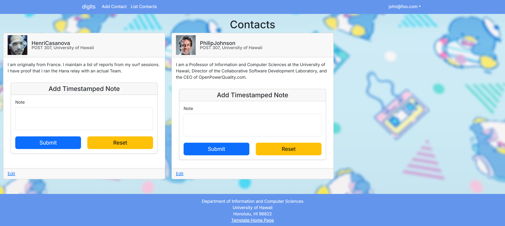
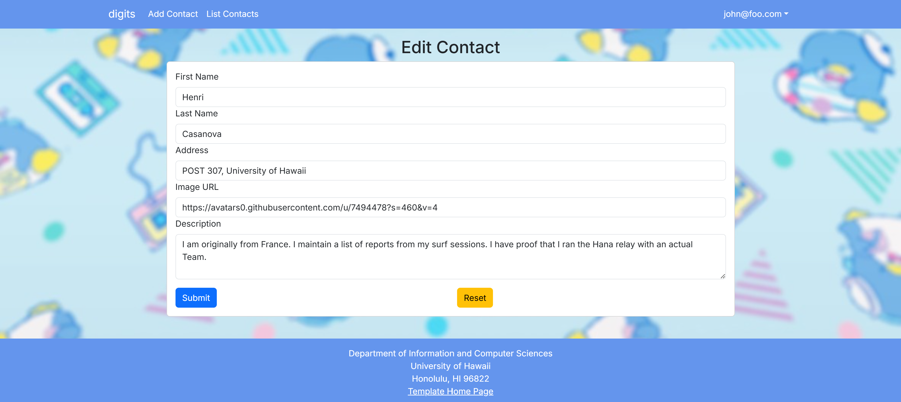

# Digits: Contact & Interaction Manager

**Digits** is a user-friendly web application that enables individuals to:

- Create an account.
- Build and maintain a personalized contact list.
- Add timestamped notes to document interactions with each contact.

---

## User Interface Overview

### Landing Page

Upon visiting the application, you're greeted with the **Landing Page** — a concise introduction to the core features Digits offers:

---

### Registration

New to Digits? Click on **Login**, then select **Sign Up** to create an account and get started.

---

### Sign In

If you already have an account, simply click **Login**, then **Sign In** to access your dashboard.

---

### User Landing Page

After logging in, you'll be directed to your personal landing page. It resembles the landing page, but includes a navigation bar with links to:

- View your contacts
- Add new contacts

---

### Viewing Contacts

Click on **List Contacts** to see all the contacts associated with your account:

Each contact entry provides the ability to attach timestamped notes, allowing you to keep track of your interactions:

---

### Editing Contacts

From the **List Contacts** view, select the **Edit** link next to any contact to update their information:

---

### Admin Access

Digits supports an **Admin Mode**. Certain users can be assigned the **Admin** role via a configuration file. Admins gain access to a special navigation link that reveals a comprehensive list of **all contacts across the platform**, not just their own.

---

> Whether you're networking, managing client relationships, or tracking personal connections, **Digits** provides a clean, intuitive interface to keep your interactions organized.

